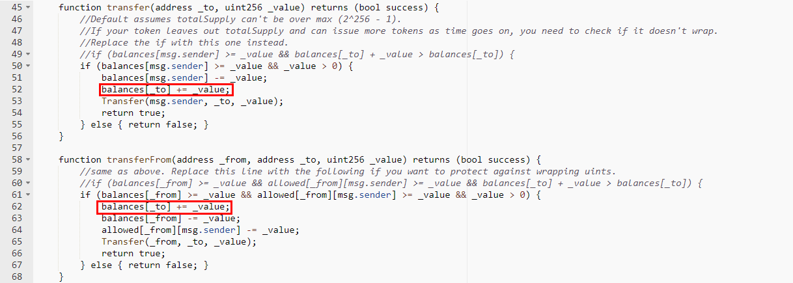

#ADB Token (ADB)

[https://etherscan.io/address/0x98db0e0110dc9d416ba3c3f211c40767964057fc#code](https://etherscan.io/address/0x98db0e0110dc9d416ba3c3f211c40767964057fc#code)

We found two integer overflow loopholes in the transfer function and transferFrom function. There's no check after += operation. A crafted _value parameter allows the balances of _to overflow.

