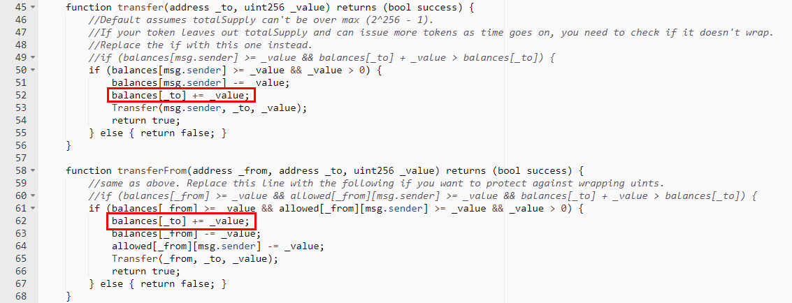

#Angobit (XPT)

[https://etherscan.io/address/0xd308a2ec3e940a4873826a9c8161c6f90463cf81#code](https://etherscan.io/address/0xd308a2ec3e940a4873826a9c8161c6f90463cf81#code)

We found two integer overflow loopholes in the transfer function and transferFrom function. There's no check after += operation. A crafted _value parameter allows the balances of _to overflow.

