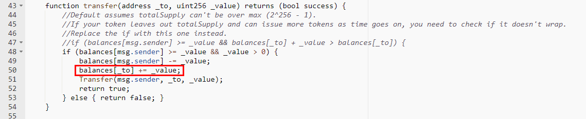
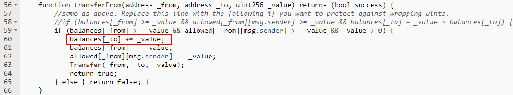

#Bittelux (BTX)

[https://etherscan.io/address/0x39D131bdD76e6D53FAbBBD5fa31E98F1d92b27AC#code](https://etherscan.io/address/0x39D131bdD76e6D53FAbBBD5fa31E98F1d92b27AC#code)

We found two integer overflow loopholes in the transfer function and transferFrom function. There's no check after += operation. A crafted _value parameter allows the balances of _to overflow.

