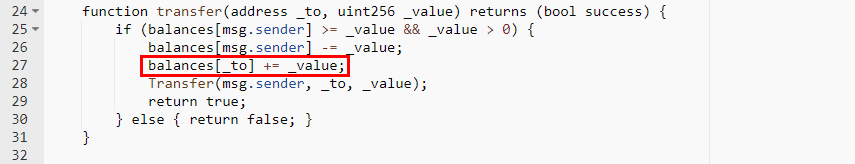
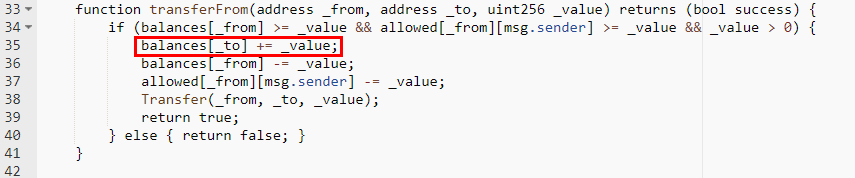

#ChuCunLingAIGO (CCLAG)

[https://etherscan.io/address/0x687d9d6839817db4574aed33f45647109dfe9c2d#code](https://etherscan.io/address/0x687d9d6839817db4574aed33f45647109dfe9c2d#code)

We found two integer overflow loopholes in the transfer function and transferFrom function. There's no check after += operation. A crafted _value parameter allows the balances of _to overflow.

