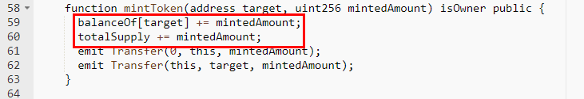
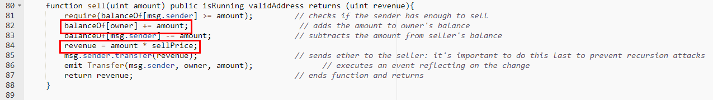

#IPGToken (IPG)

[https://etherscan.io/address/0x68454ba137100b019372338cf81bbb9db0f43d44#code](https://etherscan.io/address/0x68454ba137100b019372338cf81bbb9db0f43d44#code)

We found a few integer overflow loopholes in the mintToken and sell function. There's no check with the += operation and * operation. 

