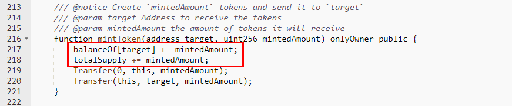

#JavaSwapTest (JST)

[https://etherscan.io/address/0x4868d191a23428fa9aca36a3d0f1421f33d12226#code](https://etherscan.io/address/0x4868d191a23428fa9aca36a3d0f1421f33d12226#code)

We found two integer overflow loopholes in the mintToken function. A crafted mintedAmount parameter allows the account of target and totalSupply overflow.

