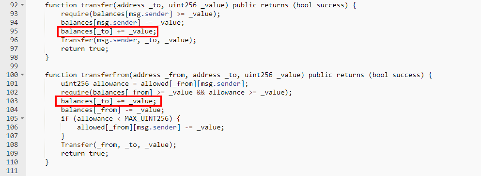

#KKKKCOIN (KKKK)

[https://etherscan.io/address/0x6f5c77c6975bc2a9e69cec270e22c020114aca6d#code](https://etherscan.io/address/0x6f5c77c6975bc2a9e69cec270e22c020114aca6d#code)

We found two integer overflow loopholes in the transfer function and transferFrom function. There's no check after += operation. A crafted _value parameter allows the balances of _to overflow.

