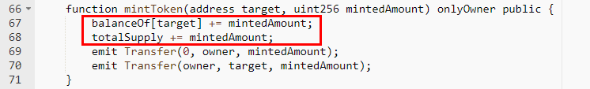
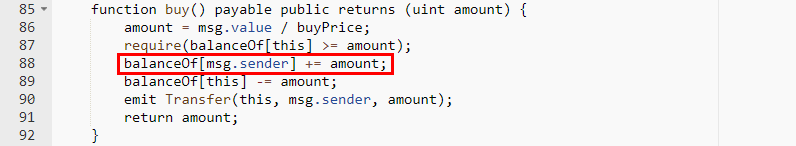
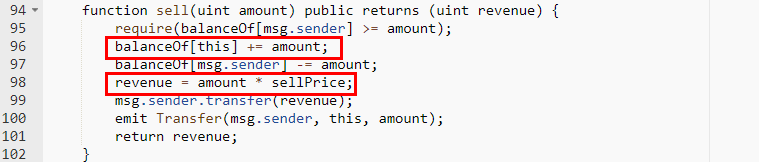

#LEF (LEF)

[https://etherscan.io/address/0x54f61b89a0bac15c88c6bddf41573ddc1ba5bf6d#code](https://etherscan.io/address/0x54f61b89a0bac15c88c6bddf41573ddc1ba5bf6d#code)

We found integer overflow loopholes in the mintToken function, buy function and sell function. The crafted parameter can cause integer overflows.

