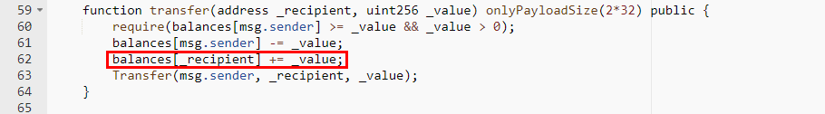
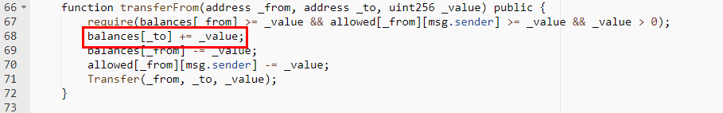
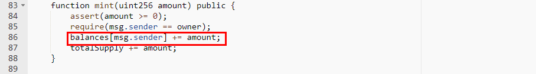

#PFGc (PFGc)

[https://etherscan.io/address/0xa2c4f961b93fc7bc200d2c8e55b6fe6958366787#code](https://etherscan.io/address/0xa2c4f961b93fc7bc200d2c8e55b6fe6958366787#code)

We found several integer overflow loopholes in this smart contract. There's no check after += operation. A crafted _value parameter and the amount parameter allows the balances of _to overflow.

