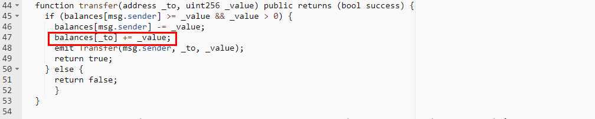
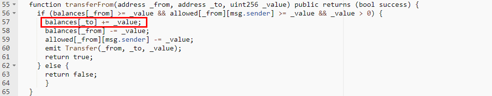

#Worldcoin1 (WRLD1)

[https://etherscan.io/address/0xb6527cd9e5c0994f5feb19fbbda57d973e3399fa#code](https://etherscan.io/address/0xb6527cd9e5c0994f5feb19fbbda57d973e3399fa#code)

We found the transfer and transferFrom function of the smart contract implementation for Worldcoin1 (WRLD1) has an integer overflow.A crafted _value parameter allows the account of _to overflow.

