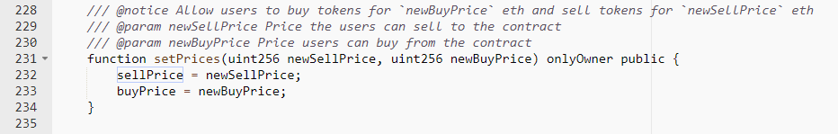
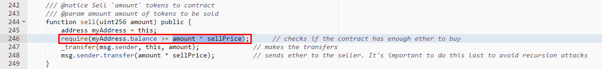

#星聚币 (XJC)

[https://etherscan.io/address/0xd41451c0e4239de79941d9678e1ec7c6d7fc2285#code](https://etherscan.io/address/0xd41451c0e4239de79941d9678e1ec7c6d7fc2285#code)

We found an integer overflow loophole in the sell function. The crafted amount value and sellPrice value allows the multiplication operation overflow.

1.set the sellprice value

2.overflow

